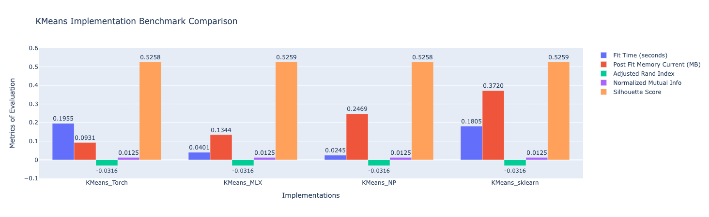

# MLX Framework Benchmark for K-Means Clustering

A performance comparison of Apple's MLX framework against PyTorch-MPS, NumPy, and scikit-learn for K-Means clustering on credit card customer data.

## Overview

This research evaluates MLX's performance on classical machine learning algorithms—specifically K-Means clustering. While MLX benchmarks typically focus on deep learning and LLMs, this project fills the gap by testing it on traditional ML tasks.

**Key Findings:**

- **Memory Efficiency**: MLX uses ~30x less peak memory than scikit-learn (0.13 MB vs 4.40 MB)
- **Surprising Result**: K-Means successfully finds clusters (Silhouette Score: 0.52), but these clusters don't align with customer churn (ARI: -0.03)

## Quick Start

```bash
# Install dependencies
pip install -r requirements.txt

# Run all benchmarks
bash run_experiments.sh
```

## Project Structure

- `src/scripts/` - Implementation for each framework (MLX, PyTorch, NumPy, sklearn)
- `src/utils/` - K-Means implementations and timing utilities
- `src/notebooks/` - EDA and results comparison
- `src/results/` - Benchmark scores and metrics

## Frameworks Tested

- **Apple MLX** - Optimized for Apple Silicon's unified memory architecture
- **PyTorch-MPS** - Using Metal Performance Shaders backend for GPU acceleration
- **NumPy** - Pure Python baseline implementation
- **scikit-learn** - Industry-standard with optimized C/Cython backend

## Evaluation Metrics

**Performance:**

- Fit time (wall-clock seconds)
- Peak memory usage (MB)

**Clustering Quality:**

- Silhouette Score (internal validation)
- Adjusted Rand Index - ARI (external validation vs. churn labels)
- Normalized Mutual Information - NMI (information-theoretic measure)

## Conceptual Framework

[File](./conceptual_framework.mermaid)


## Results


